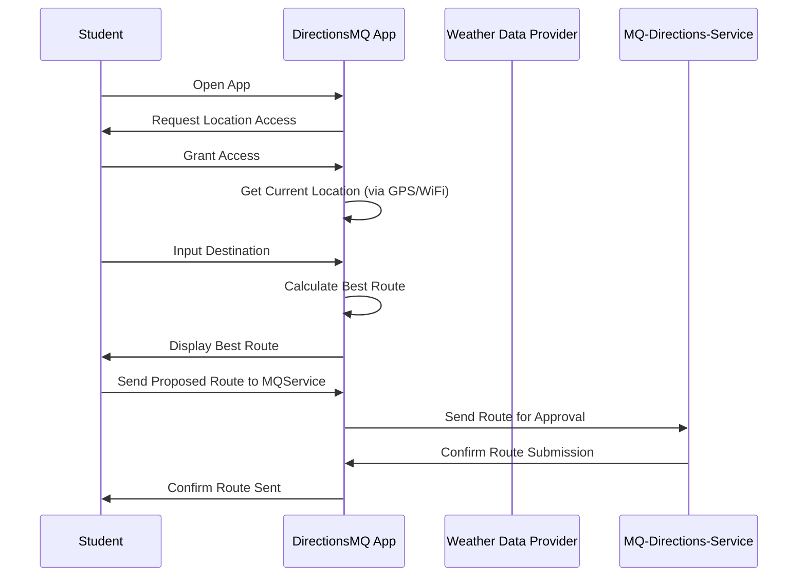

# DirectionsMQ - Software Requirements Specification

## By: Charles, Daniel, Emmanuel 

###### **Vision statement:** to create a high fidelity directions app for anyone and everyone at Macquarie University
### **Change Log**

| What changed  | Description | Date | Who made the change | Who agreed |
| ------------- | ----------- | -----| ------------------- | ---------- |
| Title page, Vision statement, Intro |  Initial formatting / adding stuff from repo | 29/08 | Charles | Daniel |
| Title page, Vision statement, Intro | Importing stuff from google doc into md | 8/09 | Charles | Daniel |
| Requirements section | Expanded upon the requirements section both functional and non-functional | 8/09 | Emmanuel | Charles |
| Use cases, formatting | Changed some of the formatting of the file for better readability and expanded on the use cases section | 8/09 | Daniel | Charles |
| Overall description, formating | Added to description, fixed some formatting | 8/09 | Charles | Daniel |
| Overall description | Completed (Needs review) | 9/09 | Charles | Daniel |
| Use case diagram | Added use case diagram | 9/09 | Charles |  |
| Discussion | Completed the discussion | 9/09 | Daniel |  |

## **Introduction**

### **Purpose:**
To act as a basis for creating ‘DirectionsMQ’. This document will lay out the framework allowing developers to know any and all details they need to create the app exactly as it was imagined. It will also provide critical information such as the requirements and use case diagrams. 

### **Scope:** 

#### **Overall scope**
- Directions app for use within the Macquarie university Macquarie Park Campus only. 
- Will only include directions for publicly accessible areas only.
- Will only include walking as a method of transport.

#### **Directions** 
- Will provide turn by turn directions outside and inside of buildings and provide an eta. 
- Offers real time foot traffic tracking and route optimisation 
- Offers driest pathing when wet or raining. 
- It will provide photos as reference for directions 
- The map can be downloaded for offline use without features that need internet access.
- It will provide alternate routes for accessibility routes if needed. 

#### **Building information**
- Provide routing to any room within a given building 
- Displays a list of user specified waypoints 
- Keeps track of opening and closing time of buildings and shops and when they are booked 

#### **Live Updates**
- Provide accurate and up to date information regarding details that will affect users (construction, events, hazards)

#### **Definitions, acronyms, and abbreviations.** These should be specific to your project.
DMQ - DirectionsMQ
MQDS - MQ-Directions-Service
DB - Database
OS - Operating System

## **Overall Description:**

#### **Product perspective:** Describes how the software fits into the overall system or environment.
- Integraton: The software for DMQ will be front end software that is able to interface with the middleware and backend of the "MQ-Directions-Service" server. The software will be designed as a mobile app in order to leverage the GPS position of the phone in order to provide up to date and relevant pathing. 

- Key features: This will allow anybody on the Macquarie campus with the app to get up to date and high fidelity directions to wherever they need to go as long as it is public facing. To do this it should be designed to work with both Apple and Andriod phones.

- Potential future expansions: Potential for integration with other already existing capus services (e.g. Timetables, Room booking). 

#### **Product functions:** Lists the main functions and capabilities of the software.
- Compatibility: The app will work on apple and andriod OS in order to cater to as many people as possible. 

- Uni Map: The app will contain a scaled 2d map, that users can interact with and search in order to find their destination

- Routing: The app will direct users on the shortest route taking into account potential obstacles (e.g. footrafic, construction, etc.)

- Dryest path: If it is raining or the path is wet, the app will present users with an option to find the dryest path. If selected the app will calculate the dryest path and present it for the user so they can make their selection of desired route. 

- Accessible routing: The app will present users with an option to find an accessible route to their destination for users who are unable to use stairs.

- Navigation Asist: The app will provide users with photo referances to help them with navigating the route.

- Rating / comments: The app will provide an overview of each building with users able to leave feedback on their experience.

- Custom waypoints: The app will allow users to pin specific spots around campus and save them localy. These can then be searched later by the user as a destination to route to.

- High fidelity: The app will contain directions within buildings so users are able to get to a specific classroom within a specified building.

- Offline access: The app will allow users to download the map for offline use. 

- User reports: The app will allow users to report things within the app which are not fucntioning as intended. (incorect routes or building open/closing times being incorectm etc.) 

- Route submission: The app will allow users to submit routes which are not already within the app to be potentially added to the routing after review. 

#### **User characteristics:** Specifies the intended users and their roles.
General User: The average user of DMQ, made up of students, staff and visitor.
- Role: Act as the main userbase for DMQ.
- Usage: Varied from average to occasional based on users familiarity with the campus.
- Needs: 
  - Easy to follow directions to desired locations within campus.
  - Accessability options for users with diabilities.
  - The latest information on campus facilites and events.
- Responsibilities:
  - Accurately describe destination.
  - Potentially submitting routes and reports for incorrect information.

DMQ-Admin: Uni Staff / Admins who monitor the app and its users.
- Role: To manage and maintain the app as well as insuring the security and integrity of the system.
- Usage: Regular, Payed to maintain the app.
- Needs: 
  - Access to all user reports and route suggestions.
  - Acess to monitoring tools for the app.
  - Access to source code and the ability to make updates and push them to users.

- Responsibilities: 
  - Keeping app information up-to-date.
  - Reviewing and actioning reports and route subbmisions from users.
  - Maintaining the integrity of the app.

MQ-Directions-Service Admin: Technical staff who operate the MQDS servers.
- Role: To provide DMQ with the ability to calculate routes and store user data.
- Usage: Regular, payed to monitor and maintain the servers.
- Needs: 
  - Access to the DMQ metrics and logs.
  - Ability to manage the API access.
  - Open communication with the DMQ-Admins to resolve issues.
- Responsibilities:
  - Ensuring the smooth operation of backend systems.
  - Allowing enough server capacity for users routing.
  - Managing the processing of data between the DB and DMQ.

#### **Constraints:** Outlines any limitations or restrictions that might affect the development or use of the software.

- Device compatibility: Any smartphone regardless of OS should be able to download and interact effectively with the app.
- GPS accuracy: The app relies on the GPS of the user's mobile phone, which may be affected when entering underground areas or buildings.
- Server load: There is the potential for server overloading if a signifcant ammount more  users are active at the same time than expected.
- Network availabilty: Although there is a offline, users will onlty be able to utalise it if they have previously downloaded the app and most of the functionality will be non-functional without a network connection. 
- Battery usage: Having a phone constantly sending and recieveing GPS data and updating the users position on the map could use a signifant ammout of battery and be undersireable for the user.
- Local storage: The size of the downloadable map needs to be reasonable enough that most user will be able to download it on to their mobile device.
- Data privacy: By tracking a mobile device's GPS signal the app has to be very careful about what information it is collecting and storing from the user in order to comply with data protection regulations.

#### **Assumptions and dependencies:** Lists assumptions made during the requirements gathering process about the system or components, and dependencies with other systems or components.

Assumptions:
- Users have a smartphone with GPS capabilities. 
- Users are willing to share there location data with the app.
- Users will have internet access in order to use most of the apps features.
- There will be regular updates on changes within the campus that the app will be able to access. (construcution, etc..)

Dependencies: 
- MQ-Directions-Service: DMQ will rely heavily on the backend service of MQDS in order to calculate routes and saving user data.
- Moblie OS: DMQ will be dependant on mobile OS's and may have its functionality affected by updates to these OS's.

## **Specific Requirements**
### **Functional requirements:**
  #### **Uni Map** 
- REQ.UM1: The system shall provide a high-fidelity map of the university, including all buildings and their specific rooms, entrances, exits, stairways, elevators, and other facilities.
- REQ.UM2: The system shall use the user's GPS location and altitude to determine their position within the university.
- REQ.UM3: The system shall provide detailed turn-by-turn indoor navigation within buildings (includes room numbers, entrances, exits, stairways, elevators, and other facilities).
- REQ.UM4: The system shall offer accessible routes for individuals with disabilities, including wheelchairs, and provide alerts if such routes are unavailable.
- REQ.UM5: The system shall monitor building opening and closing times and update routes accordingly.
- REQ.UM6: The system shall be updated with changes to university infrastructure (e.g., construction, renovations).
- REQ.UM7: The system shall display crowd density in real-time and adjust trip times if high density impacts the user's route.
- REQ.UM8: The system shall provide photos of landmarks and buildings to aid with navigation.
- REQ.UM9: The system shall allow users to rate and leave comments for different university facilities (e.g., study spots, classrooms).
- REQ.UM10: The system shall have a feature that shows locations or study spots that are out of service.

#### **Routing**
- REQ.RT1: The system shall calculate the best route based on user preferences, factoring in travel time, open/closed buildings, and accessible routes.
- REQ.RT2: The system shall allow users to add custom waypoints or pins (e.g., study spots) along their route, with no maximum limit on the number of waypoints.
- REQ.RT3: The system shall offer time-based routing, ensuring buildings are open when users pass through.
- REQ.RT4: The system shall provide offline routing for major paths, allowing users to navigate without an active internet connection by downloading routes.
- REQ.RT5: The system shall have a feature that shows routes closed and out of service due to construction or maintenance.

#### **Dryest path** 
- REQ.DP1: The system shall ping a weather API to determine if rain is expected and adjust the routing to minimize outdoor exposure when necessary.
- REQ.DP2: The system shall provide a "dryest path" option that prioritizes routes minimizing exposure to rain, possibly using indoor paths.
- REQ.DP3: The system shall allow users to prioritize either the dryest path or the fastest path based on their preference.

#### **User Reports**
- REQ.UR1: The system shall allow users to report facilities or study spots that are out of service or unavailable.
- REQ.UR2: The system shall provide the option for users to report closed routes due to construction or maintenance.
- REQ.UR3: The system shall submit user-proposed paths to the MQ-Directions-Service for consideration and possible inclusion in the app's routing system.

### **Non-Functional requirements:**
#### **Performance Requirements**
- REQN01.1: System Response Time

The system shall calculate and display the optimal route within 3 seconds of the user requesting a route.

Fit Criteria: The system will be tested with 100 different route requests under normal network conditions. At least 95% of these requests should return a route within 3 seconds.

- REQN01.2: Location Accuracy

The system shall provide a location accuracy of 5 meters or less

Fit Criteria: During testing, at least 90% of location checks (both indoor and outdoor) will be within 5 meters across 50 test scenarios.
- REQN01.3: Data Synchronization Speed

When syncing offline data with the server, the system shall upload user-saved routes and reports within 10 seconds of reconnecting to the network.

Fit Criteria: The system will be tested by saving and syncing 10 routes/reports after offline use, with 95% of synchronizations completed within 10 seconds after reconnection.

- REQN01.4: Route Recalculation Time

The system shall recalculate and update the route within 2 seconds when the user deviates from the originally suggested path.

Fit Criteria: The system will be tested with 50 instances of route deviations, and at least 90% of recalculated routes should be generated and displayed within 2 seconds of deviation detection.

#### **Reliability Requirements**
- REQN02.1: System Uptime

The system shall have an uptime of 99.9% during operational hours.

Fit Criteria: Uptime logs will be analyzed over a period of 6 months. The system should not experience more than 8 hours of downtime during that time.

- REQN02.2: Data Integrity

The system shall ensure that user-generated data (e.g., custom waypoints, routes) is not lost in case of network failure.

Fit Criteria: Testing will simulate 100 instances of network failure while saving data, and in at least 95% of cases, user data should be saved or recoverable.

- REQN02.3: Fault Recovery

The system shall recover from crashes or failures within 30 seconds of detection.

Fit Criteria: A simulated crash will be conducted 10 times, and in 90% of cases, the system should be restored within 30 seconds.

#### **Maintainability Requirements**
- REQN03.1: Code Modularity

The system shall be developed with modular components to ensure future feature additions require no more than 10% codebase modification

Fit Criteria: A code review will be conducted on the system. Any proposed feature additions should demonstrate that no more than 10% of the existing code requires modification for implementation.
- REQN03.2: Code Documentation

The system's codebase shall have clear and consistent documentation for each module, allowing new developers to understand the code within 2 hours.

Fit Criteria: A code review will be conducted with a sample of new developers. At least 90% of them should be able to explain the module's functionality after 2 hours of reviewing the documentation.

#### **Scalability Requirements**
- REQN04.1: Scalability of User Load

The system shall be able to handle 10,000 concurrent users without significant performance degradation.

Fit Criteria: Load testing will be conducted by simulating 10,000 concurrent users accessing the system, with performance metrics like response time and server load monitored. System response times should not exceed 5 seconds for at least 90% of users.

#### **Security Requirements**
- REQN05.1: Data Encryption

The system shall encrypt all user location data and routes.

Fit Criteria: A security audit will be conducted to verify that all sensitive data, such as location data and routes, is encrypted during storage and transmission.

- REQN05.2: Authentication and Authorization

The system shall require user authentication via single sign-on (SSO) and enforce role-based access control for different features (e.g., students, visitors).

Fit Criteria: A security test will verify that only authenticated users can access the system, and that access control rules prevent unauthorized access to restricted features. At least 95% of access control tests should pass.

## **Use cases**

A use case diagram can be used for an app to visually represent the interactions between its users and the system. It helps identify the main functions or features of the app, showing how different users will interact with the system for a desired outcome.

The following are descriptions of the three most important use cases:

#### **Use case #1: Routing between point A to B**

Students can use the app to find an optimal route between two points on campus. Users can interact with the app by providing their location and destination. Additionally, users can submit proposed routes to the MQ-Directions-Service server for potential approval, allowing the route to be saved and served to other users in the future to reduce overall computing power.
*(See interaction diagram bellow)*

#### **Use case #2: Routing between point A to B while raining**

Expanding on user case #1, in addition to the app calculating an optimal route between two points on campus, it can connect to an external weather data provider to get the waether data for the users current location and use that information before it calculates a route. For example if it's rainy at the users location the app will try and calculate the dryest path in addition to  the most optimal from point A to point B. Both paths are then generated and the user has the option to view both.

#### **Use case #3: User Report**

In the app, users can report issues like a closed route, out of service or unavailable locations, or suggest an alternative route that is not being displaying. To do this, they select the "Report" button, choose the type of problem, provide relevant details, and submit the report. The app then sends this report to the MQ-Directions-Service server to review, the user then receives confirmation that the report has been successfully submitted.

> *(Use case Diagram)*

> *(Interaction diagram for use case #1)*

### Discussion

To gather the requirements for the DMQ app, we used a combination of elicitation methods such as stakeholder interviews and competitive analysis. Each of these techniques allows us to create a comprehensive overview of the software requirements in relation to the app.

Stakeholder interviews were the primary method we used to elicit the software requirements of our app. We began with conducting an initial staging interview with our clients to understand what exactly our stakeholders requested out of the app. From there we received a list of requirements that our stakeholders wished to see from our app. We used this list of requirements as a foundation to build off of and expand further upon, exploring in more detail about both functional and non-functional requirements. With every revision of our software requirements we conducted follow-up interviews with the stakeholders to seek approval for the expanded list of requirements.

In addition to stakeholder interviews we conducted competitive analysis on similar navigation apps such as Google Maps and Apple Maps. While these apps are well-suited for vehicle navigation, they often fall short in campus-specific scenarios like navigating through buildings or avoiding rain. By analyzing the strengths and weaknesses of these existing solutions, we identified gaps in their functionality that DMQ could address. This allowed us to expand our software requirements to integrate features such as student submitted paths and real-time updates and temporary route changes, which would be integrated with the MQDS server.

If we were to continue this project by expanding the software requirements, we would first look to integrate more real user data. We could achieve this through the use of user surveys to broaden our understanding of user needs of the app. This could help us shape how we continue building our software requirements to better suit our real end users. Another path that we could explore in regards to expanding the project could be to begin collaborating with the campus facilities. The partnership would provide critical data about building access and planned closures due to construction or maintenance. Ultimately this would allow us to better understand the inner workings of the university management which could help us in the shaping of the extended software requirements

### Appendices

- Log of interactions with stakeholders:

22/08 - Additional requirements obtained from stakeholders 
29/08 - Confirmation on quereys regarding initial and additional requirements 
05/09 - Seeked approval for additional requirements